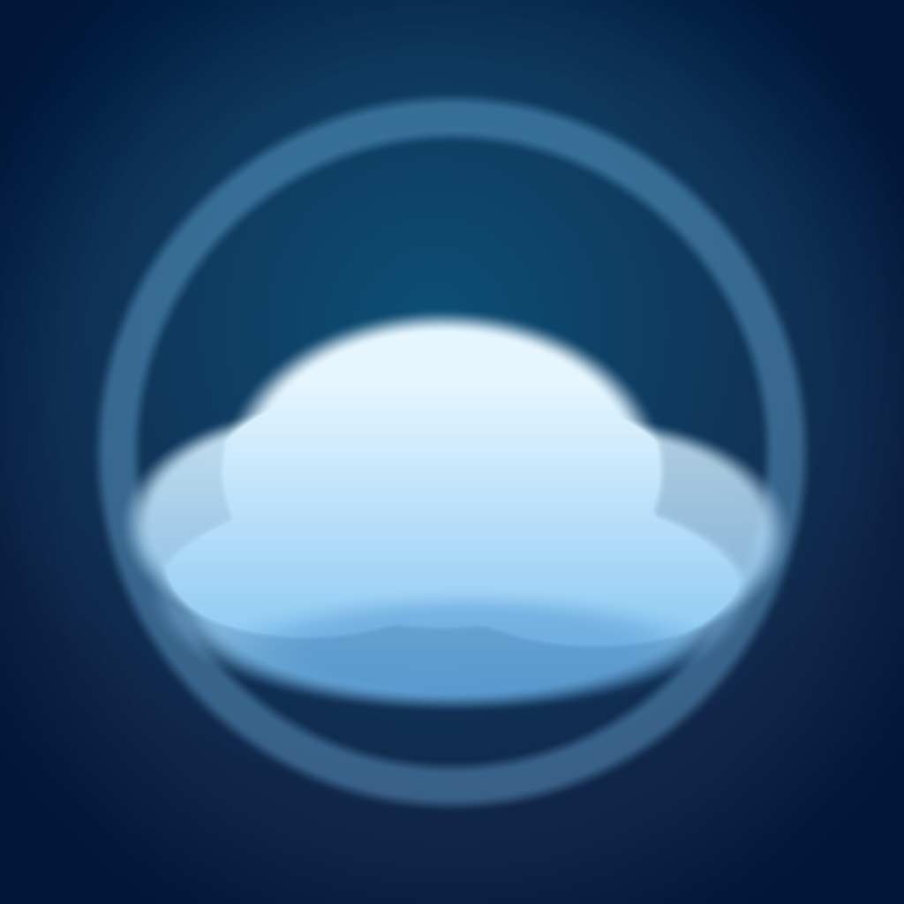

# Nimbus

<p align="center">
  
</p>

[](https://github.com/murderszn/nimbus/actions/workflows/desktop-builds.yml)


Nimbus is a polished Pomodoro timer for focused work sessions. It started as a single HTML app and now ships as a desktop client for macOS and Windows using Electron.

The app combines a cloud-inspired animated canvas interface with practical session tracking: focus blocks, short breaks, long breaks, session naming, pause history, progress metrics, theme controls, CSV export, fullscreen mode, and a compact popout timer.

## Download Nimbus

Nimbus currently ships desktop clients for macOS and Windows. iPhone and iPad builds are not published yet.

| Platform | Download |
| --- | --- |
| macOS Apple Silicon | [Download DMG](https://github.com/murderszn/nimbus/releases/latest/download/Nimbus-1.2.9-mac-arm64.dmg) |
| macOS Intel | [Download DMG](https://github.com/murderszn/nimbus/releases/latest/download/Nimbus-1.2.9-mac-x64.dmg) |
| Windows x64 | [Download Installer](https://github.com/murderszn/nimbus/releases/latest/download/Nimbus-Setup-1.2.9-x64.exe) |
| Windows x64 Portable | [Download Portable EXE](https://github.com/murderszn/nimbus/releases/latest/download/Nimbus-Portable-1.2.9-x64.exe) |

All release files are available on the [latest Nimbus release](https://github.com/murderszn/nimbus/releases/latest).

## What It Does

- Runs a classic Pomodoro flow with Focus, Short Break, and Long Break modes.
- Shows an animated cloud scene and responsive progress gauge while the timer runs.
- Tracks completed and partial sessions in a local session log.
- Stores timer state, theme choice, and history locally with `localStorage`.
- Lets sessions be named and renamed for better personal tracking.
- Exports session history to CSV.
- Includes focus metrics for total sessions, focus time, and streak progress.
- Supports fullscreen mode and a small popout timer window.
- Packages the same app into native desktop clients for macOS and Windows.

## Key Files

| Path | Purpose |
| --- | --- |
| [`pomodoro-cloud-v2.html`](./pomodoro-cloud-v2.html) | The main Nimbus web app: UI, animation, timer logic, session log, themes, and export behavior. |
| [`desktop/main.js`](./desktop/main.js) | Electron main process: app windows, menus, navigation rules, popout window handling, and desktop launch behavior. |
| [`desktop/preload.js`](./desktop/preload.js) | Small preload bridge that exposes desktop platform metadata to the app. |
| [`package.json`](./package.json) | npm scripts, Electron Builder configuration, macOS targets, Windows targets, and app metadata. |
| [`scripts/generate-icons.js`](./scripts/generate-icons.js) | Generates the desktop and web app icons from the source app icon. |
| [`assets/`](./assets) | Source, desktop, and web app icons. |
| [`.github/workflows/desktop-builds.yml`](./.github/workflows/desktop-builds.yml) | GitHub Actions workflow that builds macOS and Windows clients. |

## Run Locally

Install dependencies:

```sh
npm install
```

Run the desktop app:

```sh
npm start
```

Run with DevTools enabled:

```sh
npm run dev
```

If Electron launches as plain Node in a local shell, clear `ELECTRON_RUN_AS_NODE`:

```sh
ELECTRON_RUN_AS_NODE= npm start
```

## Build Desktop Clients

Generate icons:

```sh
npm run icons
```

Build a local unpacked desktop app:

```sh
npm run package
```

Build macOS artifacts:

```sh
npm run dist:mac
```

Build Windows artifacts:

```sh
npm run dist:win
```

Build outputs are written to `dist/`.

Expected desktop artifacts include:

- macOS Apple Silicon DMG and ZIP
- macOS Intel DMG and ZIP
- Windows x64 installer
- Windows x64 portable executable

## Validation

Run the source checks:

```sh
npm run check
```

The check script validates the Electron main process, preload script, and icon generator with Node syntax checks.

## Automated Builds

The [Desktop Builds workflow](https://github.com/murderszn/nimbus/actions/workflows/desktop-builds.yml) builds real macOS and Windows artifacts on GitHub Actions. It runs on pushes to `main` and can also be started manually from the Actions tab.

Generated build outputs are intentionally not committed. `dist/` and `node_modules/` are ignored so the repository stays focused on source code and reproducible build configuration.

## Distribution Notes

The generated desktop apps are currently unsigned.

- macOS may show Gatekeeper warnings until the app is signed with an Apple Developer ID certificate and notarized.
- Windows may show SmartScreen warnings until the app is signed with a trusted Windows code-signing certificate.

For local testing on Apple Silicon, an unpacked macOS build can be ad-hoc signed:

```sh
codesign --force --deep --sign - dist/mac-arm64/Nimbus.app
open -n dist/mac-arm64/Nimbus.app
```
